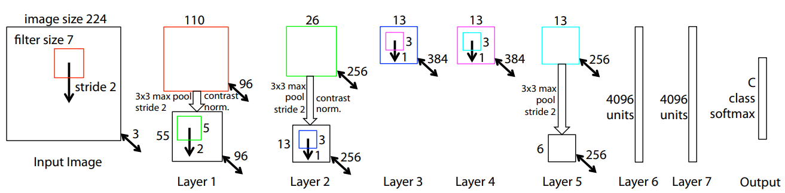
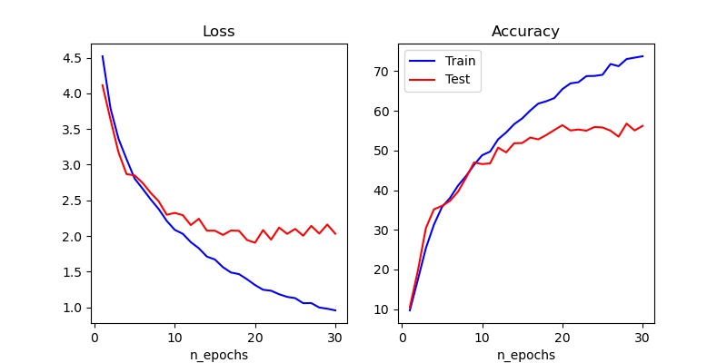
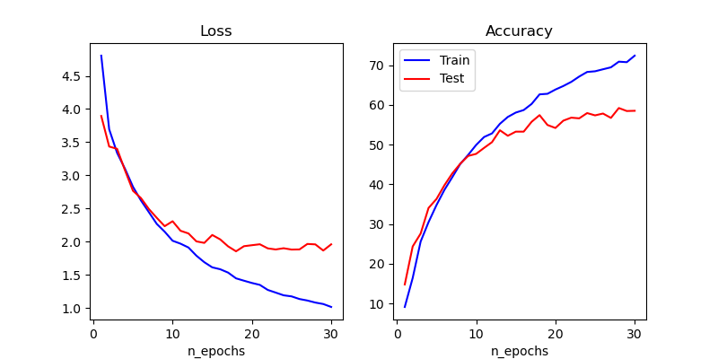
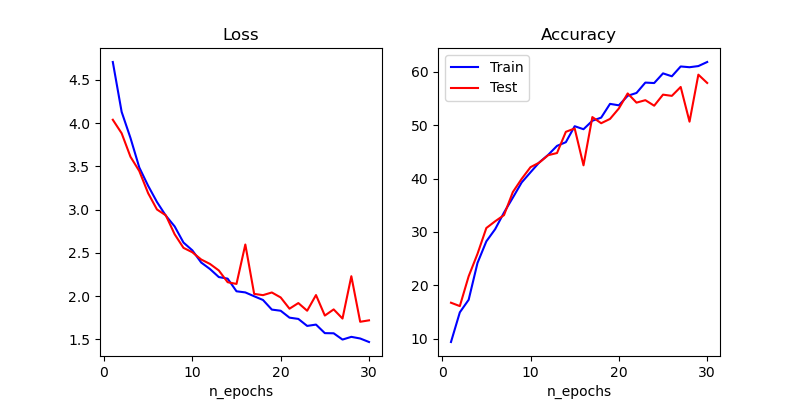

# ZF5-SPP single/multi-size training for Image Classification in Python

- This repository builds a single/multi-size-input model for image classification.

- Paper:
    + [Spatial Pyramid Pooling in Deep Convolutional Networks for Visual Recognition](https://arxiv.org/abs/1406.4729)
    + [Visualizing and Understanding Convolutional Networks](https://arxiv.org/abs/1311.2901)

Following paper: While convolutional neural networks (CNNs) require a fixed-size input image, “spatial pyramid pooling” strategy is able to eliminate the above requirement, allow multi-size input and therefore improve the performance of classification.\
So, in this repo, I implemented a very basic, simple ZF5 model using and not using SPP as well as multi-size input for performance comparison purpose on image classification problem.

## Requirements
- Python 3
- Pytorch 2.0
- Opencv-python

## Dataset
- Caltech101 is used as in the paper. This dataset is able to be downloaded by Pytorch. https://pytorch.org/vision/stable/generated/torchvision.datasets.Caltech101.html

## ZF5 Model Architecture
- The model is built restrictly following by two-above paper

## Hyper-parameters
Because of basically experimental purpose, I just use very simple hyper-params that are different from papers' ones
- NUM_CLASSES = 101
- NUM_EPOCHS = 30
- BATCH_SIZE = 128
- LEARNING_RATE = 0.001
- WEIGHT_DECAY = 0.001

## Result
3 figures below compare the performance of 3 different architectures of ZF5. We can totally show that the model using SPP with Multi-size input training has the best performance and the lowest rate of overfitting.
- ZF5 Single-size

- ZF5-SPP Single-size

- ZF5-SPP Multi-size

